# Módulo 11 - Secuencias de diseño

Los diagramas siguen la separación Vista / Controlador / Persistencia definida para Triverde.
Las fuentes entregables están versionadas individualmente como `.puml` en
`docs/trabajo-grupal/diagramas/secuencias/`, junto con sus versiones renderizadas en PNG y SVG.

## CU-78 - Registrando una máquina o vehículo mantenible

### Flujo normal

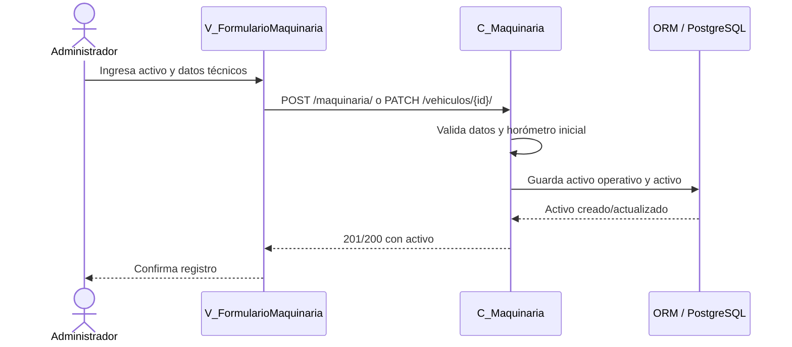

### Excepción

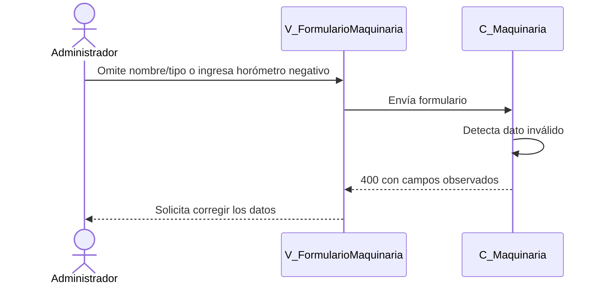

## CU-79 - Editando o dando de baja una máquina

### Flujo normal

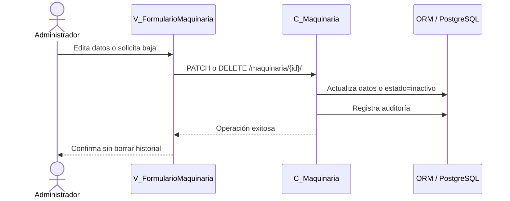

### Excepción

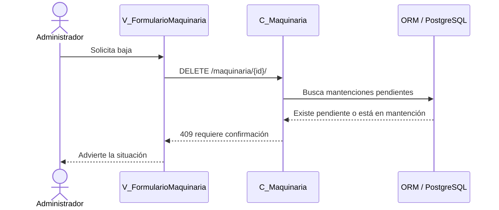

## CU-80 - Registrando las horas de uso

### Flujo normal

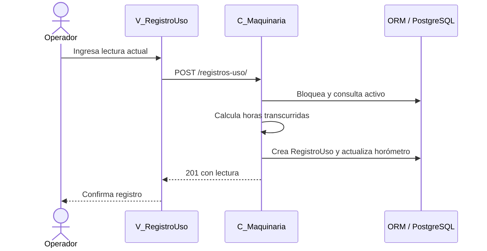

### Excepción

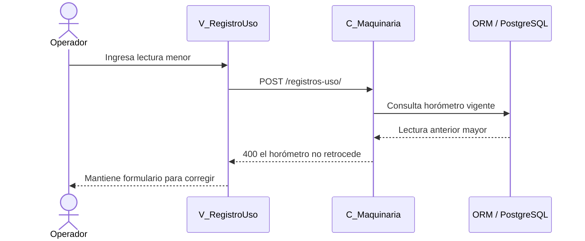

## CU-81 - Programando una mantención preventiva

### Flujo normal

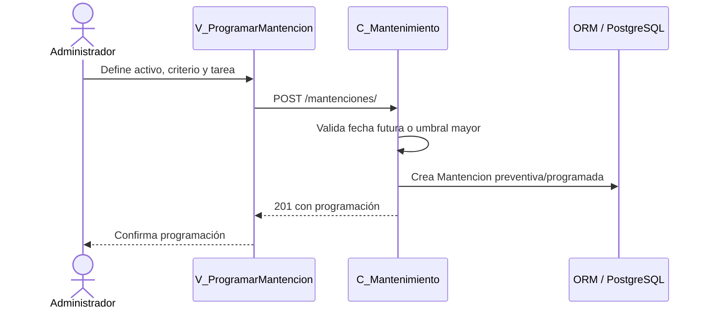

### Excepción

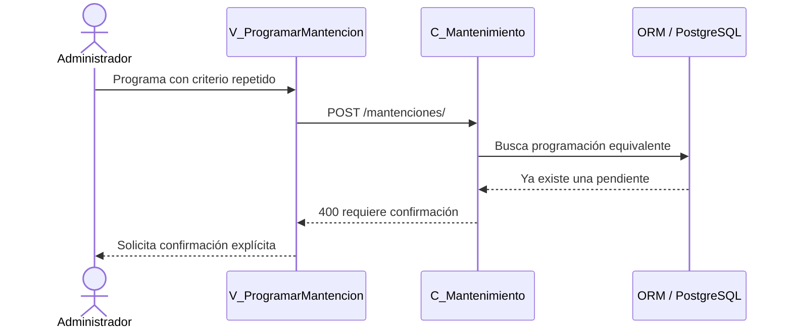

## CU-82 - Registrando una mantención correctiva

### Flujo normal

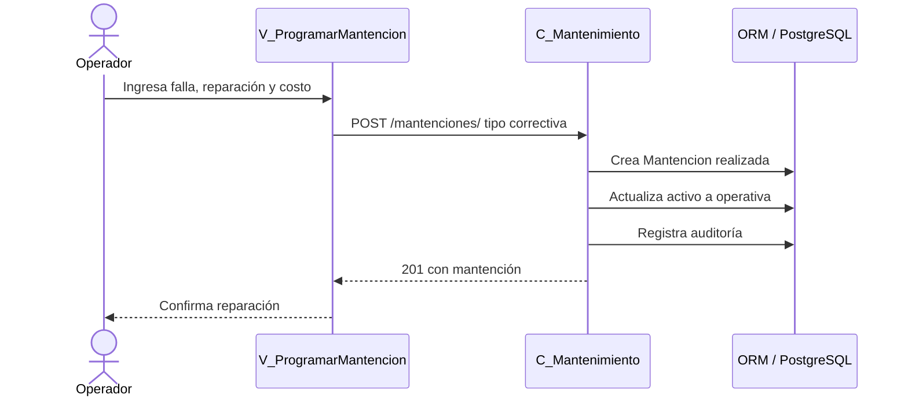

### Excepción

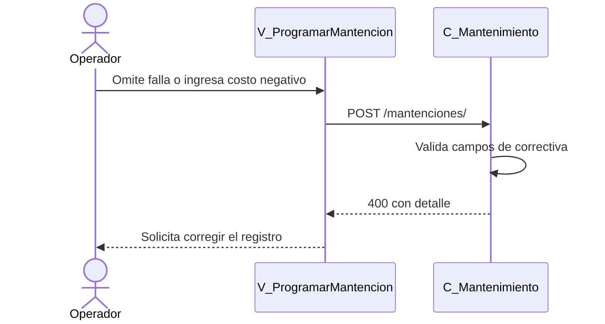

## CU-83 - Consultando el historial

### Flujo normal

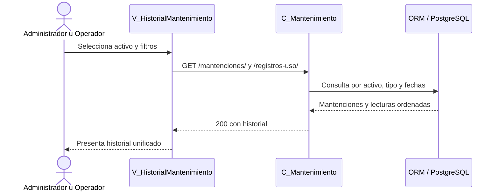

### Excepción

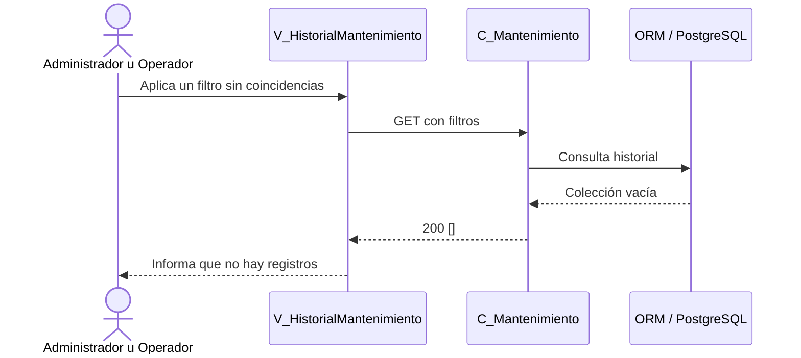

## CU-84 - Generando la alerta de mantención

### Flujo normal

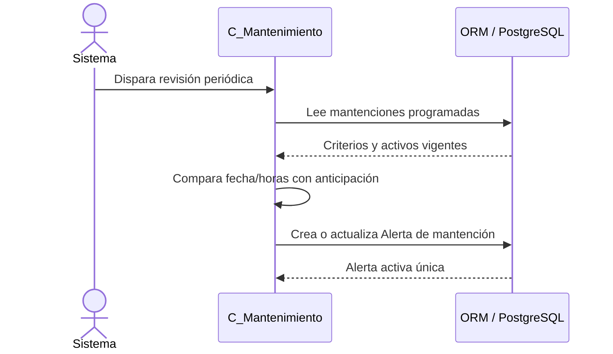

### Excepción

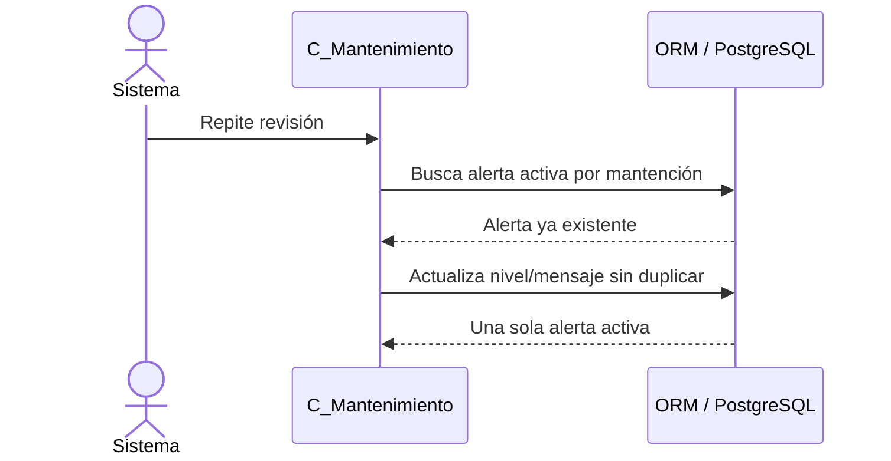

## CU-85 - Consultando el estado de la flota

### Flujo normal

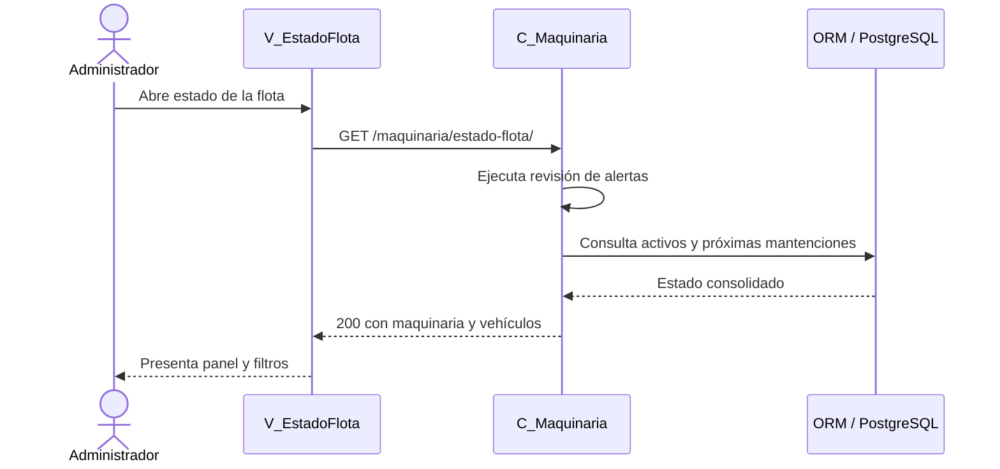

### Excepción

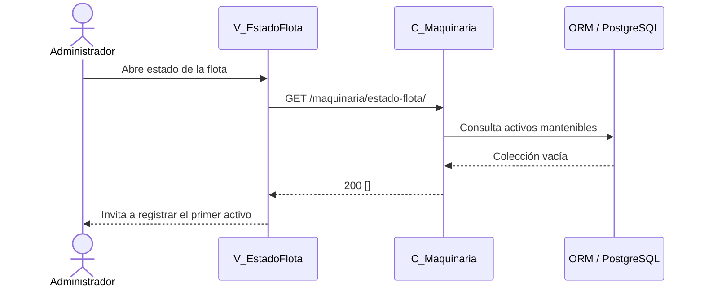
